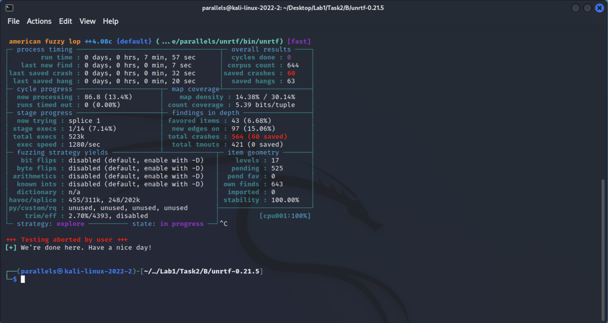

# Lab 1 - Fuzzing Technology


## Task 1 - Generating mutated test cases with Radamsa

### Task 1.1

Printing 10 malformed samples of ```Fuzztest 1337```

```
Fuzztest -156357946125506097
Fuzteut 1ㅤ337
              Fuzztest 13377
Fuzztdst 340282366920938463463374607431768211455
Fuzztes-340282366920938463463374607431768211457
Fuzzzzte1t3 s37

Fuzztest 10107352000
Guzztest 1337
Fuzztest ʳ-1232
Fuzztest 19223372036854775771
```
Command line used to make the samples

```bash
for i in {1..10}; 
do 
    echo "Fuzztest 1337" | radamsa;                           
done 
```

### Task 1.2

File ```fuzz.txt``` contains the text ```12 EF```. I have used a bash script to read the file and generate 100 different samples that are stored in different files in a seperate folder named ```Task1B-Samples```.

- Content of 5 different samples that radamsa created

```
-9223372036854775807 EF
��147483636 EF
1957 E957 EF
-18446744073709551616 EF

-83 EF
```
- Screenshot of the above samples


- Bash script I have used to create the above samples and save those files into the ```Task1B-Samples``` folder.
```bash
while read line;
do
	for iter in {1. 100}; do
		echo "$line" | radamsa >> "Task1B-Samples/Sample_$iter";
	done
done < "fuzz. txt"
```

## Task 2

### Task 2.1 - Analyzing C program with AddressSanitizer

- Command line used to compile the program

```bash
clang -fsanitize=address -g -o example example.c 
```
Here I used ```-g``` flag to add debugger information to the compiled file.

- Screenshot of the result after running


- The error and what is causing it in this program

The error is the program might have a potential memory leak.

This is because the programmer allocates a character buffer of size 1024 and then use ```sprintf``` to format the value of the integer ```argc``` and store it in the buffer. The issue comes the programmer doesn't checked the size of the converted string and whether it will fit to the allocated buffer or not. if ```argc``` is a larger integer and formatting it as a string will result in a larger size than 1024 bytes. Hence, it might cause memory leaks.

### Task 2.2 - Fuzzing with AFL

- Command line used to configure unrtf

```bash
./configure CC="/usr/bin/afl-clang" --prefix=$HOME/unrtf
```
- Checking whether the UnRTF works by converting the sample ***```small_document.rtf```*** to ***```HTML```***
```bash
~/unrtf/bin/unrtf --html /usr/share/doc/afl++-doc/afl/testcases/others/rtf/small_document.rtf
```
Output html content
```html
<!DOCTYPE html PUBLIC -//W3C//DTD HTML 4.01 Transitional//EN>
<html>
<head>
<meta http-equiv="content-type" content="text/html; charset=utf-8">
<!-- Translation from RTF performed by UnRTF, version 0.21.5 -->
</head>
<body>Test<br>
</body>
</html>
```
- Command line used to run AFL
```bash
afl-fuzz -i input_folder -o output_folder ~/unrtf/bin/unrtf
```
- Screenshot of the AFL status screen after stopping the fuzzer

 -  The most significant pieces of information on the status screen and Why are they important.

 I think the most important pieces of information contains in the ```overall results``` block. its shows the number of ```unique crashes``` which is a very crucial matric and the number of ```hangs``` where target program becomes unresponsive. 
 
 Also, the ```process timing``` block is as important as overall results because if the tool is not find any findings(last new find is 0) withing several minutes of starting you are not correctly invoking the target program or the default memory limit is too restrictive. (reference: [Understanding the status screen
](https://lcamtuf.coredump.cx/afl/status_screen.txt))

### Task 2.3 - Reproducing crashes with Valgrind

Screenshot of vulgrind results after running


Vulgrind crashes saying the file is corrupted. I have tried to figure out the reason for the valgrind failure. But failed to point out the exact issue. I am using Kali Linux ARM on Apple Silicon M1.

## Task 3 - Fuzzing libraries

- The most widely recognized name for the CVE-2014-0160 vulnerability is ```the heartbleed bug```. 

- Explanation about the crash based on the ASAN results and the pcap file and what causes the vulnerability

Here the payload length field in the heartbeat request is set to 65535 which is larger than the actual length of the payload data and the tool is using 65534 to decode the payload. This tricks the server into thinking that it needs to send a much larger portion of data in return as response. this may include sensitive data that should not be disclosed from the server.

Although an attacker has some control over the disclosed memory block's size, it has no control over its memory location, and therefore cannot choose what to get revealed at a certain time.

- Screenshots of AFL/ASAN results and the pcap file


## Task 4 - Creating your own fuzzer and fuzzing with it

The jupyter notebook for the fuzzer is uploaded in the lab1 director. Also it can be accessed [here](lab1_fuzzer_nipun%20waas.ipynb).
### A) Create a mutator

I have created a custom mutator that takes the input url and split it into sections such as ```scheme, netloc, path, query``` and do random modifications into the extracted string like replacing characters, adding new characters in between/at SOS/at EOS of random length and generating new random string instead of the existing. 
```python
# Creating the mutator
import uuid
import random
import string

''' Generating a single random string with a given length '''
def generate_random_single_string(stringLenth, onlyAscii = False):
    stringList = list(string.printable[:-5])
    if onlyAscii:
        stringList = stringList[:62]
    return ''.join(random.choice(stringList) for i in range(stringLenth))

''' 
Creating a random mutation for a given string. 
This includes
    1. Replacing character.
    2. Adding new characters in between or SOS or EOS.
    3. Generating a new string
'''
def generate_random_string(objectString, onlyAscii = False):
    generativeMutatedStringLength = 5
    mutationAction = random.randint(0, 2)
    stringList = list(string.printable[:-5])
    
    if onlyAscii:
        stringList = stringList[:62]
    # replacement
    if mutationAction == 0:
        randomIterStart = random.randint(0, len(objectString)-1)
        randomIterEnd = random.randint(randomIterStart, len(objectString)-1)
        for i in range(randomIterStart, randomIterEnd):
            objectString.replace(objectString[i], random.choice(stringList))
    # adding new characters
    elif mutationAction ==  1:
        randomIter = random.randint(0, len(objectString)-1)
        objectString = objectString[:randomIter] + ''.join(random.choice(stringList) for i in range(random.randint(0, generativeMutatedStringLength))) + objectString[randomIter:]
#     # create a new string
    elif mutationAction == 2:
        randomLength = random.randint(0, len(objectString) + generativeMutatedStringLength)
        objectString = generate_random_single_string(randomLength)
    return objectString

# Mutator function that takes a validated URL and creates random mutated URLs
def mutator(baseUrl):
    mutated_URL = ""
    # spliting the url by '/' and filtering out the white spaces
    splittedUrl = list(filter(lambda x: len(x) > 0, baseUrl.strip().split("/")))

    #scheme - choosing a random scheme from the given choices
    scheme = ["ftp://", "http://", "https://"]
    mutated_URL += random.choice(scheme)
    
    #netloc - creating a netloc with www. address and a generative host name
    netloc = "www." + generate_random_string(splittedUrl[1].split(".")[1])+ "." + generate_random_single_string(random.randint(2,4))
    mutated_URL += netloc
    
    #path - generate random path strings for each in the given url
    path = '/'.join([generate_random_string(i, True) for i in splittedUrl[2:-1]])
    mutated_URL += "/" + path + "/"
    
    # query
    querySplitted = splittedUrl[-1].split("?")
    mutated_URL += generate_random_single_string(len(querySplitted[0]), True) + "/"
    if len(querySplitted) > 1:
        queries = querySplitted[-1].split("=")
        for i in queries:
            mutated_URL += generate_random_single_string(len(i), True) + "="
    mutated_URL = mutated_URL[:-1]
    return mutated_URL
```

Below are some of the output results it generates. I have restricted the scheme to ```ftp```, ```http```, ```https``` and the netloc to always start with ```www.``` 

- The mutator generated ***15894875*** mutated input in 4 minutes. Below is a screenshot of the code block. Also samples of 20 mutations are printed in the output.


### B) Create a target program
Ii have used the validator(target program) from a pre available python library. This will check the validity of the generated url according to the specs.


The mutated results has crashed the program for 19 times out of 20. the program ran smoothly otherwise. Mutator produces lot of inputs in netloc, path and query with special characters seems to crash the validator.

### C) Create a simple fuzzer

Results of the fuzzing for 3 test cases.

```
Test Case: 100 Crashed count: 88
Test Case: 1000 Crashed count: 880
Test Case: 10000 Crashed count: 8873
```


Here the Fuzzer runs for 3 different test cases: ```100, 1000, 10000```. Below attached the malformed inputs that caused the crashes for above 3 test cases.


### D) Generating mutations with Radamsa and observing program execution

I have utilized radamsa to generate malformed inputs from the given url and save it in a text file ```output.txt```. I have generated over ```11100``` at once and saved it in a ```.txt``` file and used it as a input to the validator above.

The bash script that used to generate the inputs from radamsa:

```bash
#!/bin/bash

for iter in {1..11100}; do
        echo "http://www.google.com/search?q=fuzzing" | radamsa >> output.txt;
done
```

The fuzzer validator performance is in regards to crash count is significantly reduced when compared to my mutator. Because radamsa repeatedly generate same successful url more often and hence it does not varies at sometime. But my mutator is produces special character strings and replces them with the existing ones and produces distinct inputs randomly hence it will generate input that crashes more. Below is a screenshot of radamsa results, some crashed urls and some successfully invoked urls.


## Task 5