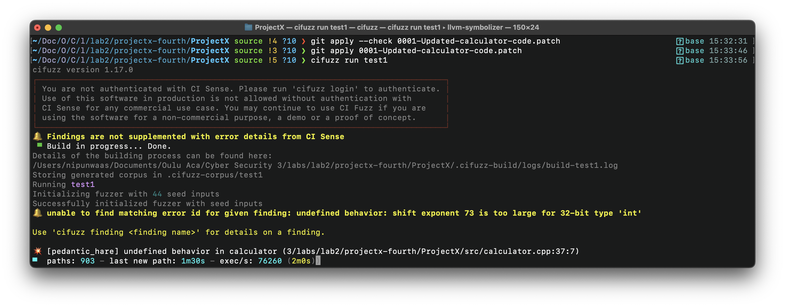

# Lab 2 - Fuzz Automation

I am using Mac OS Ventura 13.5 with Apple Silicon M1. I haven't use linux environments for this project since ```cifuzz``` does not support ARM with linux but support for ARM with Mac. So, this lab exercise will be done in Mac environment. Also, the arch vm provided does not allow me to install ```cifuzz```. 
## Task 1 

### Task 1.1 - Setting up CI Fuzz in the project repository locally

- Command line used to setup the in the project repository

```bash
git clone -b source https://github.com/ouspg/ProjectX.git
cd ProjectX
cifuzz init
```

- What did I change in cifuzz.yaml and why? 

I have changes the build system in the used to build the project. ?? TO-DO WRITE MORE

```yaml
build-system: cmake
```

- Configure CMake files

I have setted up the sub directory cmake file with teh necessary file names and library names and linked those withe parent cmake file. Also, enabled the fuzz testing and built the project. Below shows the two cmakelists files.

 ```cmake
cmake_minimum_required(VERSION 3.16)
project(cmake_example) #update project name

set(CMAKE_CXX_STANDARD 11)
set(CMAKE_CXX_STANDARD_REQUIRED ON)

enable_testing()

find_package(cifuzz NO_SYSTEM_ENVIRONMENT_PATH)
enable_fuzz_testing()

add_subdirectory(src)

add_executable(${PROJECT_NAME} main.cpp)
target_link_libraries(${PROJECT_NAME} PRIVATE calculator)

 ```
 ```cmake
 add_library(calculator calculator.cpp)
target_sources(calculator PUBLIC calculator.h)
```
Below shows the build commands and the output after successfully building the project. 

```bash
mkdir build
cd build
cmake ..
```


### Task 1.2 - Create an empty fuzz test template file

 The command line you used to create a empty test template file

In the root directory
```bash
mkdir test
cifuzz create cpp --output test/test1.cpp 
```

### Task 1.3 - Run fuzzer with empty test case


- Command used to run the fuzzer

```bash
cifuzz run test1
```

## Task 2 - Write a fuzz test case and look for bugs in the project


### Task 2.1 - Update fuzz test file with correct code

Contents of the fuzz test file

```cpp
#include <iostream>

#include <cifuzz/cifuzz.h>
#include <fuzzer/FuzzedDataProvider.h>

#include "../src/calculator.h"

FUZZ_TEST_SETUP() {}

FUZZ_TEST(const uint8_t *data, size_t size) {
  FuzzedDataProvider fuzzed_data(data, size);
  int num1 = fuzzed_data.ConsumeIntegral<int8_t>();
  int num2 = fuzzed_data.ConsumeIntegral<int8_t>();
  std::string op = fuzzed_data.ConsumeRandomLengthString();

  // For debugging purpose
  std::cout<< num1 << " " << op[0] << " " << num2 << std::endl;
  calculator(num1, op[0], num2);
}
```
Screenshot of the fz test file


### Task 2.2 - Update main

I have wrote 26 test cases to cover all the if-else branched in calculator function with some edge cases. 

- Enough for the scope of the project?
 No. Since I haven't consider floating point numbers(because the calculator only works with integer) for calculator these test cases are not enough to cover the project. So, to enable and add those tests as well we need to modify the calculator function in order. But other than that these test cases covers the all the branches in the code.


### Task 2.3 - Run the fuzzer

- The command I used to run the fuzzer

```bash 
cifuzz run test1
```
- Name of the bugs

I could not find any bugs after trying for several hours and different ways/configurations. I have contacted this with Lab Assistant too. My setup and ocnfiguration is inline but fuzing doesn't find any bugs. Below attached a screenshot. I am using mac m1 (ARM) to run this.


But adding the below two lines to the calculator.cpp found a bug which is expected. This was done catch the expected bug and to check if something else broken or not inline. 
```cpp
int n = 37;
n >>= 73;
```

It throws a RUNTIME_ERROR on ```undefined-behavior```: shift exponent 73 is too large for 32-bit type 'int'.
Below attached a screenshot of the finding.


### Task 2.4 - Generate a code-coverage report and write a brief summary about what it represents

- The command use to create a coverage report

```bash
cifuzz coverage test1
```
- Screenshots of the coverage reports


- Summary of the coverage report

The coverage report shows that the fuzzer has covered almost all the functionality in the calculator with the inputs it has generated and injected.  Also, the line coverage has covered all the branches in the switch-case statement. This is important when analysing the fuzzing inputs and to what extend those inputs can cover the code area. because to find a bug we need to go through every scenario and discover what can go wrong and make exceptions.
## Task 3

### Task 3.1 - Apply patch fix and fuzz again

Bug dicovered named ```undefined behavior: shift exponent 73 is too large for 32-bit type 'int'```. This happens because from ```n <<= 73``` it tries to shift bits to left by 73. 'int' typically has 32 bits in most C and C++ implementations. Shifting by 73 bits is not defined for a 32-bit 'int' because it exceeds the valid range. Hence, this raises a bug. Below attached a screenshot.



### Task 3.2 - Design a fuzzer job

I have implemented this one in this [repo](https://github.com/SoftwareHardwareSecurity-2023/software-and-hardware-security-submissions-waasnipun). This will automatically trigger the build of the Docker image and containerize the application and runs it. It will generate the ```cifuzz finding``` and the ```cifuzz coverage``` too at the end. Below attached the screenshots of the all results and fuzzing summary. It is catching a ```undefined behaviour``` bug in the ```calculator.cpp``` file. This is due to the bit shifting implemented in the calculator fundtion (```n <<= 73;```).


I have edited the Dockerfile to get the files from local directory and not from a remote repo(instructed by the comments). Also, wrote a pipeline using github workflow to automate the Dockerfile building into a container and running it. 

Github actions workflow .yaml

```yaml
name: ProjectX2 Workflow - Nipun Waas
run-name: ${{ github.actor }} is testing out cifuzz CI/CD 🚀
on:
  push:
    branches: [ "main" ]
  pull_request:
    branches: [ "main" ]
jobs:
  build:
    runs-on: ubuntu-latest
    steps:
      - uses: actions/checkout@v3
      - name: Build the Docker image
        run: |
          cd Week2/ProjectX2 
          docker build . --file Dockerfile --tag projectx2
      - name: Run Docker Container
        run: docker run projectx2
```

Added lines for the dockerfile

```Dockerfile
RUN mkdir ProjectX2
COPY . /ProjectX/ProjectX2
```

## Task 4 - Implement CI pipeline and fuzz an existing software or a project w.r.t. automation

Original project: Password Strength (https://github.com/VirusZzHkP/Password_Strength) \
Fuzzer: cifuzz \
CI pipeline: github actions

**Link to my project repo:** https://github.com/waasnipun/Password_Strength

For this task I have chosed a password strength checker cpp project which I found through github. It takes a string as a input and check the strength of the string according to the standard password rule checks. I have forked the repo from the initial creater to my account and made some changes to the code in order to make it more robust and strong against vulnerabilities. Also, added bazel as build system to the project and used docker to containerize the application and run it in the github actions. 

The automated pipeline is well designed. It stores the fuzzing logs and upload them into the github artifact. For each workflow, it will upload the log file to the artifact and there you can find the detected bugs and the reports of coverage. Below attached a workflow dashboard and the workflow file.


```yaml
name: PassStrength Workflow - Nipun Waas
run-name: ${{ github.actor }} is testing out cifuzz CI/CD 🚀
on:
  push:
    branches: [ "main" ]
  pull_request:
    branches: [ "main" ]
jobs:
  build:
    runs-on: ubuntu-latest
    steps:
      - uses: actions/checkout@v3
      - name: Build the Docker image
        run: docker build . --file Dockerfile --tag passcheckerimage
      - run : docker images
      - name: Run Docker Container and Get Container ID
        id: container
        run: |
          container_id=$(docker run -d passcheckerimage)
          echo "::set-output name=container_id::$container_id"
      - name: Wait for Container to Finish
        run: |
          container_id="${{ steps.container.outputs.container_id }}"
          while [ -n "$(docker ps -q --filter "id=$container_id")" ]; do
            echo "Container is still running, waiting..."
            sleep 10
          done
      - run: docker ps -a
      - run: mkdir logs
      - name: Copy logs from container
        run: |
          container_id="${{ steps.container.outputs.container_id }}"
          docker cp $container_id:/PasswordStrength/fuzzing.log ./logs
      - name: Create GitHub Artifact
        uses: actions/upload-artifact@v2
        with:
          name: code-coverage-logs 
          path: ./logs 

```
Below attached a screenshot of the logs results. The checker code has been very well written and I couldn't find any vulanarability within the given time :( . Apart from that the pipeline and the integration of the fuzz automation into a software was achieved successfully. 


Cheers !!
